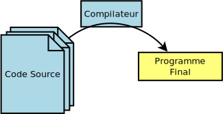

class: title

# Logiciel libre

---
class: title

# Qui sommes nous ?

---

# Qui sommes nous ?

Matthieu Gautier.  
Développeur indépendant chez Kymeria.

Clément Oudot.  
Salarié chez Savoir-faire Linux.

---
class: title

# Logiciel Libre

---

# Logiciel ?

--

D'après le Larousse :

`Ensemble des programmes, procédés et règles relatifs au fonctionnement
d'un ensemble de traitement de données`

---

# Logiciel ?

D'après le Larousse :

`Ensemble des `** programmes**`, procédés et règles relatifs au fonctionnement
d'un ensemble de traitement de données`

???

Programme ?

--

Des instructions pour l'ordinateur.

Illisibles pour un humain, donc on les écrit dans un langage de programmation.

Les instructions "pour les humains" sont appelées le code source. (les sources)

---

# Code source et binaire

???

Analogie avec la musique.

- Le binaire est le cd/mp3

- Les sources sont les partitions/piste audio séparé

---

# Logiciel libre ?

--

## L'histoire

Au début, le logiciel n'a pas d'importance.

--

Les ordinateurs sont de simples «super calculatrices».
Et on vend du matériel, on ne vend pas le calcul fait par les calculatrices.

--

Début 80, Richard Stallman veut corriger le pilote de son imprimante et 
il découvre qu'il n'a pas accès aux sources.

Il crée donc le projet GNU et la licence GPL.

???

GNU : Gnu is Not Unix
GPL : General Public License

---

# Logiciel libre

4 libertés fondamentales :

- Liberté d'utiliser
- Liberté d'analyser
- Liberté de modifier
- Liberté de redistribuer

--

Ce sont des contraintes légales.

???

Et pas techniques.

Même si ça a un impact technique.

---

# Liberté d'utiliser

J'ai la liberté d'utiliser le logiciel comme je veux, où je veux, pour ce que je veux.

--

Ça semble évident, mais ça ne l'est pas.

- Windows fournit avec votre ordinateur n'est légalement utilisable que sur votre ordinateur
- Un logiciel d'envoi de mail pourrait interdire de s'en servir pour envoyer des spams.
- Un logiciel d'échange de fichiers qui voudrait interdire les échanges de fichiers illégaux.
- Utiliser MacOS sur un PC.
- Utiliser un logiciel Windows sur un autre système d'exploitation.
- Problème avec les embargos internationaux.

---

# Liberté d'analyser

Comment être sûr que le logiciel fait bien ce que **je** veux ?

- Nécessité d'avoir le code source.
- Nécessité de pouvoir reconstruire le logiciel à partir des sources.

---

# Liberté de modifier

Utiliser comme **je** veux  
⇒ Cas d'utilisation auxquels le développeur n'a pas pensé  
⇒ Nécessité de pouvoir modifier le logiciel

- Ajout de fonctionnalités
- Suppression de fonctionnalités
- Correction de bug
- Adaptation à d'autre environnement, machine, ...

---

# Liberté de redistribuer

J'ai le droit de redistribuer le logiciel que j'ai eu.  
J'ai le droit de redistribuer mes modifications.

Deux (grandes) variantes :

- Je dois redistribuer en donnant les mêmes droits ⇒ L'utilisateur sera toujours libre. (Copyleft)
- Je peux redistribuer en retirant des droits ⇒ Le logiciel est libre (Je l'utilise comme je veux).

---

# Logiciel libre vs Open source

4 libertés fondamentales :

- Liberté d'utiliser
- Liberté d'analyser
- Liberté de modifier
- Liberté de redistribuer

???

Parler de la différence Logiciel libre vs open source

Android

---

# Garantie

- Si tout le monde peut redistribuer mon logiciel, comment je fais pour fournir une garantie sur mon logiciel ?
- Si tout le monde peut modifier le logiciel, suis-je tenu de fournir une garantie sur le logiciel ? Et sur ses modifications ?

--

⇒ Pas de Garantie.

On peut rajouter une garantie *à coté*.  
Mais c'est un autre contrat, ce n'est pas relatif au logiciel libre.

???

Marque déposée de Firefox. (Garantie liée au nom)

---

# Gratuité ?

Rien n'est spécifié par rapport au prix.

On parle de distribution et la vente est une forme de distribution.

Dans la pratique, la majorité des logiciels sont gratuits.  
Un premier acheteur peut redistribuer le logiciel gratuitement.

---

# Gratuité ?

Les développeurs ne travaillent pas gratuitement.  
Le logiciel n'est pas gratuit.

«Un logiciel libre devient libre une fois qu'il a été payé.»  
*François ELIE*

---

# Exemples

- Firefox/Chromium
- LibreOffice
- Thunderbird
- VLC
- Gimp/Scribus/Inkscape/Blender
- Drupal/Wordpress
- Linux

???

Différence Chromium / Chrome

---

# Exemples

- Firefox/Chromium
- LibreOffice
- Thunderbird
- VLC
- Gimp/Scribus/Inkscape/Blender
- Drupal/Wordpress
- Linux

- Android / Replicant
- MacOS (enfin... pas vraiment)

???

Android, c'est compliqué

MacOs basé sur FreeBSD.

---

# Exemples

|Projet|l.o.c.|nb changement|nb contributeurs|
|:---:|:---:|:---:|:---:|
|linux|18 000 000|638 000 (819)|15 291 (288)|
|firefox|13 000 000|271 000 (4558)|3 655 (396)|
|libreoffice|7 000 000|433 000 (1297)|1 522 (91)|
|vlc|592 000|64 000 (322)|735 (24)|
|gimp|762 000|36 000 (132)|556 (25)|

---

# Distribution

Un système d'exploitation, c'est des centaines de logiciels.

Chaque logiciel est un projet différent, qui fonctionne seul avec sa communauté
et ses propres règles

Il faut réunir tout les logiciels, les compiler, choisir les bonnes options.

Donc les gens se regroupent en communautés (encore) et font le travail ensemble
pour distribuer tout ces logiciels de manière cohérente.

- Fedora
- Ubuntu
- Debian
- Red Hat
- Gentoo
- ...

---
class: title

# La communauté

---

# Qui contribue ?

- Individuel
- Entreprise
- Association

--

- Des développeurs (beaucoup)
- Des designers/graphistes (pas assez)
- Des traducteurs (pas assez)
- Des rédacteurs de documentations (pas assez)
- Des testeurs (pas assez)

---

# Qui contribue ?

- Red Hat
- IBM
- Google
- Canonical
- Facebook
- Twitter
- Apple
- IBM
- Microsoft
- ...

???

Pour les plus connus

---

# Pourquoi contribuer

Des raisons diverses et variées.

Pour les individuels :

- pour répondre à un besoin personnel (fonctionnel)
- par idéologie

Pour les entreprises, il y a des modèles économiques.

???

On en parlera plus tard

---
class: dualtitle

# La communauté
##Et son organisation

---

# Bordel ?

- Tout le monde a accès au code source
- Tout le monde peut modifier le code
- Tout le monde peut redistribuer *sa* version
- Tout le monde cherche à résoudre un problème *personnel*

=> Bonjour le bordel

--

Oui ... mais non.

---

# Collaboratif à grande échelle

Dans la pratique les gens s'organisent.

Les communautés du logiciel libre sont les pionnières dans le travail
collaboratif, à grande échelle, sans hiérarchie forte.

---

# Des outils

- CSV (Git, bz, svn, ...)
- Bugtracker
- Mailing list, Forum
- IRC

???

CSV: Gestion du code et de son évolution. Centralisé ou non

Bugtracker: Suivi des bugs et des améliorations. Ouvert à tous.

Ml: Discussions plus ou moins généralistes. Non structuré

IRC: Messagerie instantanée, salons de discussion 

--

Les outils sont des aides.  
Ils ne résolvent rien à notre place. Ils simplifient la communication ...
et c'est tout.

---

# Une organisation "sociale"

- Une personne/équipe est désignée responsable du projet.
- Les autres lui envoient des modifications.
- Ils deviennent donc contributeurs
- Le responsable maintient une base de code «de référence»
- Les contributeurs s'appuient sur cette base pour travailler

???

Mise en place naturelle.

- Le créateur du projet est de facto le mainteneur.
- Personne n'a intérêt à maintenir un projet en //

---

# Conflits

Les conflits peuvent arriver :

- Incompétence du développeur principal
- Erreur
- Désaccord sur des choix techniques
- Désintéressement du développeur principal
- ...

---

# Scissions

Des scissions peuvent arriver :  
=> Fork (Fourchette en anglais)

- Fork amical (on est pas d'accord sur l'orientation du projet, on en fait deux)
- Fork agressif

---

# L'épée de Damoclès

Le fork est relativement facile à mettre en place.  
Mais il faut que les gens suivent pour que le fork réussisse.

C'est un gros risque. Ça peut complètement couler un projet.

---

# L'épée de Damoclès

La communauté peut décider du jour au lendemain de ne plus suivre les 
développeurs principaux.

Les développeurs principaux ne le sont **que** parce que la communauté leur
délègue ce rôle.

---

# Une organisation floue

Une organisation s'appuyant sur le travail de différents acteurs.

- Basée sur des communautés disparates
- Pas de chef
- Des moyens de contrôles et de sanctions

--

Principalement possible car les gens sont libres.

???

Matériel / Virtuel

---
class: title

# Économie du logiciel libre

---

# Une économie basé sur le service

Si en pratique le code est gratuit, on peut toujours "vendre" le reste :

- Le développement
- La mise en place
- La formation

---

# Une économie basé sur la licence

On vend la «garantie» autour du logiciel libre sous forme d'abonnement.

Red Hat vend des licences qui correspondent à du support.

- Correction de bug (en temps limité)
- Assistance technique
- ...

---
class: title

# Implication politique

---

# Argent public

Les logiciels payés, commandés par des organisations publiques devraient être
libres.

ADULLACT soutient et coordonne l'action des Administrations et Collectivités
territoriales dans le but de promouvoir, développer et maintenir un patrimoine
de logiciels libres utiles aux missions de service public.

???

Mutualisation

Les organisation publiques sont financées par de l'argent public (du contribuable).
Donc les logiciels sont payés par l'argent public.
Donc les logiciels devrait être librement utilisable pour tout le monde.

Ils devraient donc être libres.

---

# Démocratie

Le logiciel est présent partout.

L'informatique est devenue le socle de notre société.  
On l'utilise pour se tenir informé. Pour échanger avec nos amis. Pour s'exprimer,
pour s'amuser, se divertir.  
On travaille avec. On paie avec. On se nourrit (pas encore) avec.

La domotique et l'IOT feront qu'on se logera avec.

Google crée des voitures autonomes, on se déplacera avec.

On vit **et on pense** avec.  
Les algorithmes choisissent ce que nous voyons.  
Les algorithmes choisissent ce que nous pensons ?

---

# Logiciels et démocratie

- Le logiciel de calcul des impôts
- Le logiciel des machines à voter.
- Le logiciel de Volkswagen qui «triche aux tests anti-pollution»

???

Changement cordée / france

---

# Services et démocratie

- Facebook

???

Facebook a fait une expérience.
Ils ont choisi les messages qu'ils montrait à leurs utilisateurs en fonction du
caractère positif ou non des messages.  
=> Les gens qui ont lu plus de messages positifs ont posté plus de messages positifs. (et inversement)  
=> Facebook a la possibilité de nous influencer.  
=> Et il l'a fait.  

---

# Services et démocratie

- Facebook
- Google

???

Les recherches google sont contextualisées. Selon qui vous êtes, google ne vous
retourne pas les mêmes résultats.
Il vous retourne des résultats que vous attendez, qui vous correspondent.

C'est bien... mais ce n'est pas neutre.
En fonction de vos idées (et des idées qu'il se fait de vous), les résultats ne sont pas les mêmes
En fonction des résultats, vos idées ne sont pas les mêmes.

Google à la possibilité de vous influencer politiquement.

Est-ce qu'il le fait ?
On ne sait pas.

Par contre, il cherche à vous influencer «économiquement»
C'est même son cœur de métier, il vend de la publicité.
(Et il le fait bien)

---

# Services et démocratie

- Facebook
- Google
- Twitter

???

Que se passe-t-il si Twitter ne montre que 9 tweet 10.  
Que se passe-t-il si les journalistes se base sur le nombre de tweets pour
calculer la «popularité» des hommes politiques.

---

# Logiciel libre, plus qu'un enjeu technique

Le logiciel libre trouve sa définition dans la technique.  
Mais ça a une portée plus grande.

Dans une société démocratique, il faut que les outils sur lesquels elle se base
soient accessibles **et maitrisables** au plus grand monde.
  
*L'informatique* doit appartenir à tout le monde. Pas à un petit groupe.

Si le peuple ne contrôle pas le socle sur lequel se base la société, est-ce qu'il
est vraiment souverain ?

---
class: title

# Questions ?

---

# Informations diverses

Cette présentation est sous licence [CC-BY-SA](http://creativecommons.org/licenses/by-sa/3.0/fr/).

Les sources de cette présentation sont disponible à l'adresse : https://github.com/mgautierfr/presentation-logiciel-libre
